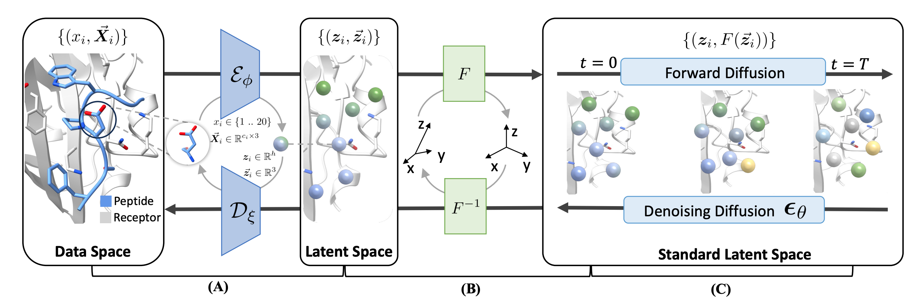

# PepGLAD: Full-Atom Peptide Design with Geometric Latent Diffusion



## Quick Links

- [Setup](#setup)
    - [Environment](#environment)
    - [Datasets](#datasets)
    - [Trained Weights](#trained-weights)
- [Usage](#usage)
    - [Peptide Sequence-Structure Co-Design](#peptide-sequence-structure-co-design)
    - [Peptide Binding Structure Prediction](#peptide-binding-structure-prediction)
- [Reproduction of Paper Experiments](#reproduction-of-paper-experiments)
    - [Codesign](#codesign)
    - [Binding Conformation Generation](#binding-conformation-generation)
- [Contact](#contact)
- [Reference](#reference)


## Setup

### Environment

The conda environment can be constructed with the configuration `env.yaml`:

```bash
conda env create -f env.yaml
```

The codes are tested with cuda version `11.7` and pytorch version `1.13.1`.

Don't forget to activate the environment before running the codes:

```bash
conda activate PepGLAD
```

#### (Optional) pyRosetta

PyRosetta is used to calculate interface energy of generated peptides. If you are interested in it, please follow the instruction [here](https://www.pyrosetta.org/downloads) to install.

### (Optional) Datasets

These datasets are only used for benchmarking models. If you just want to use the trained weights for inferencing on your cases, there is no need to download these datasets.

#### PepBench

1. Download

The datasets, which are originally introduced in this paper, are uploaded to Zenodo at [this url](https://zenodo.org/records/13373108). You can download them as follows:

```bash
mkdir datasets  # all datasets will be put into this directory
wget https://zenodo.org/records/13373108/files/train_valid.tar.gz?download=1 -O ./datasets/train_valid.tar.gz   # training/validation
wget https://zenodo.org/records/13373108/files/LNR.tar.gz?download=1 -O ./datasets/LNR.tar.gz   # test set
wget https://zenodo.org/records/13373108/files/ProtFrag.tar.gz?download=1 -O ./datasets/ProtFrag.tar.gz     # augmentation dataset
```

2. Decompresss

```bash
tar zxvf ./datasets/train_valid.tar.gz -C ./datasets
tar zxvf ./datasets/LNR.tar.gz -C ./datasets
tar zxvf ./datasets/ProtFrag.tar.gz -C ./datasets
```

3. Process

```bash
python -m scripts.data_process.process --index ./datasets/train_valid/all.txt  --out_dir ./datasets/train_valid/processed  # train/validation set
python -m scripts.data_process.process --index ./datasets/LNR/test.txt  --out_dir ./datasets/LNR/processed  # test set
python -m scripts.data_process.process --index ./datasets/ProtFrag/all.txt --out_dir ./datasets/ProtFrag/processed # augmentation dataset
```

The index of processed data for train/validation splits need to be generated as follows, which will result in `datasets/train_valid/processed/train_index.txt` and `datasets/train_valid/processed/valid_index.txt`:

```bash
python -m scripts.data_process.split --train_index datasets/train_valid/train.txt --valid_index datasets/train_valid/valid.txt --processed_dir datasets/train_valid/processed/
```

#### PepBDB

1. Download

```bash
wget http://huanglab.phys.hust.edu.cn/pepbdb/db/download/pepbdb-20200318.tgz -O ./datasets/pepbdb.tgz
```

2. Decompress

```bash
tar zxvf ./datasets/pepbdb.tgz -C ./datasets/pepbdb
```


3. Process

```bash
python -m scripts.data_process.pepbdb --index ./datasets/pepbdb/peptidelist.txt --out_dir ./datasets/pepbdb/processed
python -m scripts.data_process.split --train_index ./datasets/pepbdb/train.txt --valid_index ./datasets/pepbdb/valid.txt --test_index ./datasets/pepbdb/test.txt --processed_dir datasets/pepbdb/processed/
mv ./datasets/pepbdb/processed/pdbs ./dataset/pepbdb  # re-locate
```


### Trained Weights

- codesign: `./checkpoint/codesign.ckpt`
- conformation generation: `./checkpoints/fixseq.ckpt`

Both can be downloaded at the [release page](https://github.com/THUNLP-MT/PepGLAD/releases/tag/v1.0). These checkpoints were trained on PepBench.

## Usage

:warning: Before using the following codes, please first download the trained weights mentioned above.

### Peptide Sequence-Structure Co-Design

Take `./assets/1ssc_A_B.pdb` as an example, where chain A is the target protein:

```bash
# obtain the binding site, which might also be manually crafted or from other ligands (e.g. small molecule, antibodies)
python -m api.detect_pocket --pdb assets/1ssc_A_B.pdb --target_chains A --ligand_chains B --out assets/1ssc_A_pocket.json
# sequence-structure codesign with length in [8, 15)
CUDA_VISIBLE_DEVICES=0 python -m api.run \
    --mode codesign \
    --pdb assets/1ssc_A_B.pdb \
    --pocket assets/1ssc_A_pocket.json \
    --out_dir ./output/codesign \
    --length_min 8 \
    --length_max 15 \
    --n_samples 10
```
Then 10 generations will be outputed under the folder `./output/struct_pred`.

### Peptide Binding Conformation Generation

Take `./assets/1ssc_A_B.pdb` as an example, where chain A is the target protein:

```bash
# obtain the binding site, which might also be manually crafted or from other ligands (e.g. small molecule, antibodies)
python -m api.detect_pocket --pdb assets/1ssc_A_B.pdb --target_chains A --ligand_chains B --out assets/1ssc_A_pocket.json
# generate binding conformation
CUDA_VISIBLE_DEVICES=0 python -m api.run \
    --mode struct_pred \
    --pdb assets/1ssc_A_B.pdb \
    --pocket assets/1ssc_A_pocket.json \
    --out_dir ./output/struct_pred \
    --peptide_seq PYVPVHFDASV \
    --n_samples 10
```
Then 10 conformations will be outputed under the folder `./output/struct_pred`.


## Reproduction of Paper Experiments

Each task requires the following steps, which we have integrated into the script `./scripts/run_exp_pipe.sh`:

1. Train autoencoder
2. Train latent diffusion model
3. Calculate distribution of latent distances between consecutive residues
4. Generation & Evaluation

On the other hand, if you want to evaluate existing checkpoints, please follow the instructions below (e.g. conformation generation):

```bash
# generate results on the test set and save to ./results/fixseq
python generate.py --config configs/pepbench/test_fixseq.yaml --ckpt checkpoints/fixseq.ckpt --gpu 0 --save_dir ./results/fixseq
# calculate metrics
python cal_metrics.py --results ./results/fixseq/results.jsonl
```

### Codesign

Codesign experiments on PepBench:

```bash
GPU=0 bash scripts/run_exp_pipe.sh pepbench_codesign configs/pepbench/autoencoder/train_codesign.yaml configs/pepbench/ldm/train_codesign.yaml configs/pepbench/ldm/setup_latent_guidance.yaml configs/pepbench/test_codesign.yaml
```


### Binding Conformation Generation

Conformation generation experiments on PepBench:

```bash
GPU=0 bash scripts/run_exp_pipe.sh pepbench_fixseq configs/pepbench/autoencoder/train_fixseq.yaml configs/pepbench/ldm/train_fixseq.yaml configs/pepbench/ldm/setup_latent_guidance.yaml configs/pepbench/test_fixseq.yaml
```

## Contact

Thank you for your interest in our work!

Please feel free to ask about any questions about the algorithms, codes, as well as problems encountered in running them so that we can make it clearer and better. You can either create an issue in the github repo or contact us at jackie_kxz@outlook.com.

## Reference

```bibtex
@article{kong2024full,
  title={Full-atom peptide design with geometric latent diffusion},
  author={Kong, Xiangzhe and Huang, Wenbing and Liu, Yang},
  journal={arXiv preprint arXiv:2402.13555},
  year={2024}
}
```
